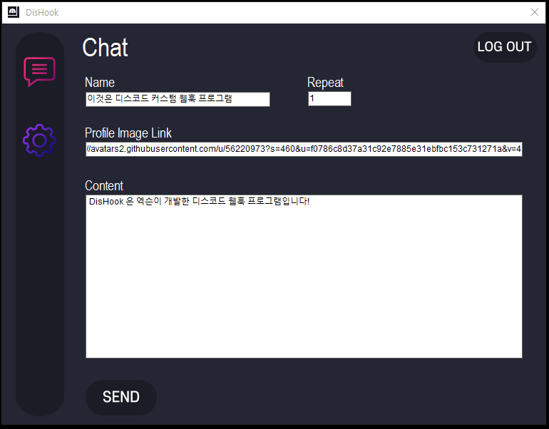

# DisHook
<b>디스코드의 웹훅 기능을 사용자가 쉽게 커스텀 할 수 있게 만든 프로그램입니다.</b>   

  
<b>※만일 이 코드를 악용할 경우, 책임은 사용자에게 있습니다</b>  
[바로 소스코드 보기](https://github.com/1-EXON/DisHook/tree/master/Discord%20Webhook/Discord%20Webhook)  

## 사용법
### 설치
[릴리즈 설치 파일 바로가기](https://github.com/1-EXON/DisHook/releases)  
 
<b>빠른 설치</b>  

[v1.0](https://github.com/1-EXON/DisHook/releases/download/v1.0/Setup.msi) 
### 활용법
1. 설치를 하여 프로그램을 실행한다.
2. 웹훅 링크를 복사하여 Log In 버튼을 클릭하거나 엔터를 누른다.
3. Name 에는 원하는 웹훅의 이름(아무것도 안쓰면 원래 웹훅 이름), Profile Image Link 에는 원하는 웹훅의 이미지 링크(아무것도 안쓰면 원래 웹훅 이름), Content에는 메세지의 내용을 쓰시고 Repeat 은 그 메세지를 반복하여 보냅니다.(<b>예) 4</b>메세지를 4번 반복하여 보냄)

### 꿀팁
Log Out 버튼으로 다른 웹훅을 사용할수도 있습니다.  
Setting 창에 들어가 설정을 할수도 있습니다.  
에브리원 멘션은 `@everyone`, 사용자 멘션은 `<@사용자 아이디>` 입니다  

